### A Microsoft Power BI [...] enables users to create highly formatted, fixed-layout documents archiving.

- [ ] dashboard.
- [ ] interactive report.
- [x] paginated report.
- [ ] subscription.

### Platform as a service (PaaS) database offerings in Azure provide built-in high availability.

- [x] Yes.
- [ ] No.

### Platform as a service (PaaS) database offerings in Azure provite configuration scaling options.

- [x] Yes.
- [ ] No.

### Platform as a service (PaaS) database offerings in Azure reduce the administrative overhead for managing hardware.

- [x] Yes.
- [ ] No.

### Which scenario is an example of a streaming workload?

- [ ] Sending transactions that are older than a month to an archive.
- [ ] Sending transactions daily from point of sale (POS) devices.
- [x] Sending telemetry data from edge devices.
- [ ] Sending cloud infrastructure metadata every 30 minutes.

### Stream processing has access to the most recent data received or data within a rolling time window.

- [x] Yes.
- [ ] No.

### Batch processing must occur immediately and have latency in the order of second or milliseconds.

- [ ] Yes.
- [x] No.

### Stream processing in used for simple response functions, aggregates, or calculations such as rolling averages.

- [ ] Yes.
- [x] no.

### You are deploying a software as a service (SaaS) application that requires a relational database for Online Transaction Processing (OLTP). Which Azure service should you use to support the application?

- [ ] Azure Cosmos D3.
- [ ] Azure Synapse Analytics.
- [ ] Azure HCMmtghi.
- [x] Azure SQL Database.

### Extract, transform, and load (ETL) can reduce the transfer of  sensitive data to destination systems.

- [ ] Yes.
- [x] No.

### Extract, load, and transform (ELT) transforms data by using a  compute resource independent of the source system and destination system.

- [x] Yes.
- [ ] No.

### Extract, load, and transform (ELT) minimizes the time it takes to copy large volumes of data to destination systems.

- [ ] Yes.
- [x] No.

### You need to recommend a data store service that meets the following requirements: Native SQL API access. Configurable indexes. What should you recommend?

- [ ] Azure FilesB.
- [ ] Azure Blob storageC.
- [ ] Azure Table storageD.
- [x] Azure Cosmos DB.

### Batch processing can output data to a file store.

- [x] Yes.
- [ ] No.

### Batch processing can output data to a relational database.

- [x] Yes.
- [ ] No.

### Batch processing can output data to a NoSQL database.

- [ ] Yes.
- [x] No.

### What is a benefit of hosting a database on Azure SQL managed instance as compared to an Azure SQL database?

- [x] Native support for cross-database queries and transactions.
- [ ] Built-in high availability.
- [ ] System-Initiated automatic backups.
- [ ] Support for encryption at rest.

### A team of developers has computers Thai run Windows 10 and Ubuntu Desktop. The developers need to connect to and query an Azure SQL database from the computers. The developers require code assistance features such as intellSense. What should the developers use?

- [x] Azure Data Studio.
- [ ] Sq1cmdC.
- [ ] Microsoft SQL Server Management Studio (SSMS).
- [ ] Azure Data Explorer.

### Batch workloads [...].

- [ ] process data in memory, row-by-row.
- [ ] collect and process data at most once a day.
- [ ] process data as new data is received in near real-time.
- [x] collect data and then process the data when a condition is met.

### A block of code that runs In a database Is callea [...].

- [x] a stored procedure.
- [ ] a table.
- [ ] a view.
- [ ] an index.

### Match the types of activities to the appropriate Azure Data Factory activities.

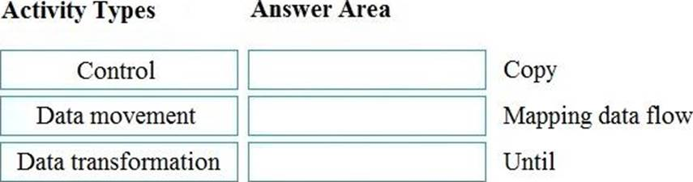

- [x] Copy: Data movement. Mapping data flow: Data transformation. Until: Control.
- [ ] Copy: Data transformation. Mapping data flow: Data movement. Until: Control.
- [ ] Copy: Data movement. Mapping data flow: Control. Until: Data transformation.
- [ ] Copy: Data transformation. Mapping data flow: Control. Until: Data movement.

### You have the following SQL query. INSERT INTO dbo.Products (ProductID, ProductName, Price, ProductDescription) Values (1,'Calmp',12.48,'Workbench clamp');

- [x] Dbo.Products: A table. ProductName: A column.
- [ ] Dbo.Products: A table. ProductName: An index.
- [ ] Dbo.Products: An index. ProductName: A database.
- [ ] Dbo.Products: A database. ProductName: A table.

### Relational data is stored in [...].

- [ ] A file system as unstructured data.
- [ ] A hierarchal folder structure.
- [x] A tabular form of rows and columns.
- [ ] Comma-separated value (CSV) files.

### A key/value data store is optimized for [...].

- [ ] Enforcing constraints.
- [x] Simple lookups.
- [ ] Table joins.
- [ ] Transactions..

### Azure Data Studio can be used to query an Azure SQL database from a device that runs macOS.

- [ ] Yes.
- [x] No.

### Microsoft SQL Server Management Studio (SSMS) enables users to create and use SQL notebooks.

- [ ] Yes.
- [x] No.

### Azure Data Studio can be used to restore a database.

- [x] Yes.
- [ ] No.

### Which command should you run?

- [ ] Az scorage share create.
- [ ] Az scorage account creace.
- [ ] Az cosmosdb creace.
- [x] Az scorage concainer creace.

### Which Azure service should you use?

- [x] Azure Cosmos DB.
- [ ] Azure Table storage.
- [ ] Azure Files.
- [ ] Azure Blob Storage.

### At which two levels can you set the throughput for an Azure Cosmos DB account?

- [x] Container.
- [ ] Item.
- [x] Database.
- [ ] Partition.

### You need to create a visualization of running sales totals per quarter as shown in the following exhibit. What should you create in Power BI Desktop?

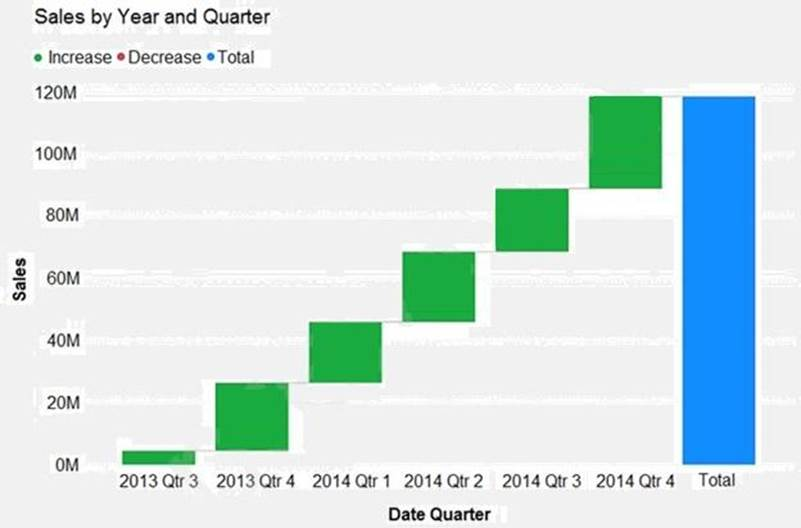

- [x] A waterfall chart.
- [ ] A ribbon chart
- [ ] A bar chart.
- [ ] A decomposition tree.

### Physically sorts the data in a table based on the values in specified column [...].

- [ ] A view.
- [x] A clustered index.
- [ ] A stored procedure.
- [ ] A nonclustered index.

### In an object associated with a table that sorts and stores the data rows in the table based on their ket values [...].

- [x] A clustered index.
- [ ] A FileTable.
- [ ] A foreing key.
- [ ] A stored procedure.

### A job that processes sales data once daily in na example of a batch workload.

- [x] Yes.
- [ ] No.

### A job that calculates a rolling average temperature readling in an example of a streaming workload.

- [x] Yes.
- [ ] No.

### A job that calculates average revenue per product for the last month in an example pf a streaming workload.

- [ ] Yes.
- [x] No.

### You have a quality assurance application that reads data from a data warehouse. Which type of processing does the application use?

- [x] Online Transaction Processing (OLTP)
- [ ] Batch processing.
- [ ] Online Analytical Processing (OLAP).
- [ ] Stream processing.

### Your company needs to design a database that shows how changes traffic in one area of a network affect other components on the network. Which type of data store should you use?

- [ ] Key/value.
- [x] Graph.
- [ ] Documentd.
- [ ] Columnar.

### You need to store data in Azure Blob storage for seven years to meet your company’s compliance requirements. The retrieval time of the data is unimportant. The solution must minimize storage costs. Which storage tier should you use?

- [x] Archive.
- [ ] Hot.
- [ ] Cool.

### To configure an Azure Storage account to support both security at the folder level and atomic directory manipulation [...].

- [x] Enable the hierarchical namespace.
- [ ] Set Account kind to BlobStorage.
- [ ] Set Performance to Premium.
- [ ] Set Replication to Read-access geo-redundant storage (RA-GRS).

### Match the security components to the appropriate scenarios.

- [ ] Prevent access to an Azure SQL database from another network: Encryption. Support Azure Active Directory (Azure AD) sign-ins to an Azure SQL database: Firewall. Ensure that sensitive data never appears as plain text in an Azure SQL database: Authentication.
- [ ] Prevent access to an Azure SQL database from another network: Authentication. Support Azure Active Directory (Azure AD) sign-ins to an Azure SQL database: Firewall. Ensure that sensitive data never appears as plain text in an Azure SQL database: Encryption.
- [x] Prevent access to an Azure SQL database from another network: Firewall. Support Azure Active Directory (Azure AD) sign-ins to an Azure SQL database: Authentication. Ensure that sensitive data never appears as plain text in an Azure SQL database: Encryption.
- [ ] Prevent access to an Azure SQL database from another network: Authentication. Support Azure Active Directory (Azure AD) sign-ins to an Azure SQL database: Encryption. Ensure that sensitive data never appears as plain text in an Azure SQL database: Firewall.

### You can use Azure Data Studio to query a Microsoft SQL Server big data cluster.

- [x] You.
- [ ] No.

### You can use Microsoft SQL Server Management Studio (SSMS) to query an Azure Synapse Analytics data warehouse.

- [x] Yes
- [ ] No.

### You can use MySQL Workbench to query Azure Database for MariaDB databases.

- [x] Yes.
- [ ] No.

### A relational database is appropriate for scenarios that involve a high volume of [...].

- [ ] changes to realtionships between entites.
- [ ] geographically distributed writes.
- [x] transactional writes.
- [ ] writes that have varying data structures.

### The Azure Cosmos DB API in configured separately for each database in an Azure Cosmos DB account.

- [x] Yes.
- [ ] No.

### Partition keys are used in Azure Cosmos DB to opyimize queries.

- [ ] Yes.
- [x] No.

### Items contained in the same Azure Cosmos DB logical partition can have different partition keys.

- [ ] Yes.
- [x] No.

### You need to gather real-time telemetry data from a mobile application. Which type of workload describes this scenario?

- [ ] Online Transaction Processing (OLTP).
- [ ] Batch.
- [ ] Massively parallel processing (MPP).
- [x] Streaming.

### Which statement should you use in a SQL query to change the inventory quantity of Product1 to 270?

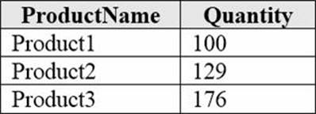

- [ ] INSERT.
- [ ] MERGE.
- [x] UPDATE.
- [ ] CREATE.

### Match the types of data stores to the appropriate scenarios. [...] Application users and their and default language.

- [ ] Graph.
- [ ] Object.
- [x] Key/value.

### Match the types of data stores to the appropriate scenarios. [...] Medical images and their associated metadata.

- [ ] Graph.
- [x] Object.
- [ ] Key/value.

### Match the types of data stores to the appropriate scenarios. [...] Employee data that shows the realtionships between employees.

- [x] Graph.
- [ ] Object.
- [ ] Key/value.

### Which type of non-relational data store supports a flexible schema, stores data as JSON files, and stores the all the data for an entity in the same document?

- [x] Document.
- [ ] Columnar.
- [ ] Graph.
- [ ] Time series.

### Azure Table storage supports multiple read replicas.

- [x] Yes.
- [ ] No.

### Azure Table storage supports multiple write regions.

- [ ] Yes.
- [x] No.

### The Azure Cosmos DB Table API supports multiple read replicas.

- [x] Yes.
- [ ] No.

### The Azure Cosmos DB Table API supports multiple write regions.

- [x] Yes.
- [ ] No.

### Match the types of workloads the appropriate scenario. [...] Data for a product catalog vail be loaded every 12 hours to a data warehouse.

- [x] Batch.
- [ ] Micro-batch
- [ ] Streaming.

### Match the types of workloads the appropriate scenario. [...] Data for online purchases will be loaded to a Gata warehouse as the purchases occur.

- [ ] Batch.
- [ ] Micro-batch
- [x] Streaming.

### Match the types of workloads the appropriate scenario. Updates to inventory data will be loaded to adata warehouse every 1,000 transactions.

- [ ] Batch.
- [x] Micro-batch
- [ ] Streaming.

### Your company needs to implement a relational database in Azure. The solution must minimize ongoing maintenance.  Which Azure service should you use?

- [ ] Azure HDInsight.
- [x] Azure SQL Database.
- [ ] Azure Cosmos DB.
- [ ] SQL Server on Azure virtual machines.

### Which Azure SQL offering supports automatic database scaling and automatic pausing of the database during inactive periods?

- [ ] Azure SQL Database Hyperscale.
- [x] Azure SQL managed instance.
- [ ] Azure SQL Database serveless.
- [ ] Azure SQL Database elastic pod.

### Which component of Azure Data Factory enables you to define a sequence of activities including for each iterators?

- [x] Control flow.
- [ ] Linked services.
- [ ] Datasets.
- [ ] The integration runtime.

### You are writing a set of SQL queries that administrators will use to troubleshoot an Azure SQL database. You need to embed documents and query results into a SQL notebook. What should you use?

- [ ] Microsoft SQL Server Management Studio (SSMS).
- [x] Azure Data Studio.
- [ ] Azure CLID.
- [ ] Azure PowerShell.

### What are three characteristics of an Online Transaction Processing (OLTP) workload?

- [ ] Denormalized data.
- [x] Heavy writes and moderate reads.
- [ ] Light writes and heavy reads.
- [x] Schema on write.
- [ ] Schema on read.
- [x] Normalized data.

### What are two uses of data visualization?

- [x] Represent trends and patterns over time.
- [x] Communicate the significance of data.
- [ ] Implement machine learning to predict future values.
- [ ] Consistently implement business logic across reports.

### Your company recently reported sales from the third quarter. You have the chart shown in the following exhibit. Which type of analysis is shown for the fourth quarter?

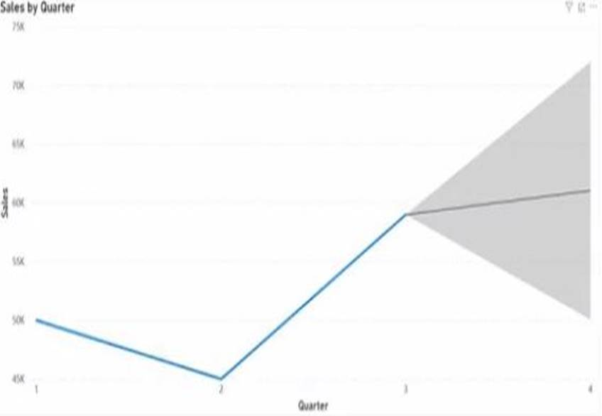

- [x] Predictive.
- [ ] Prescription.
- [ ] Descriptive.
- [ ] Diagnostic

### Which three actions are used when performing diagnostic analytics?

- [x] Identify data anomalies. Collect anomaly-related data. Discover relationships and trends that explain anomalies.
- [ ] Identify data anomalies. Predict when anomalies are likely to recur. Use analytical tools such as decision trees and regression.
- [ ] Apply serf-learning loops to draw inferences from anomalies. Predict when anomalies are likely to recur. Use analytical tools such as decision trees and regression.
- [ ] Identify data anomalies. Use machine learning to find patterns in large datasets. Discover relationships and trends that explain anomalies.

### Platform as a service (PaaS) database offerings in Azure require less setup and configuration effort than infrastructure as a service (IaaS) database offerings.

- [x] Yes.
- [ ] No.

### Platform as a service (PaaS) database offerings in Azure provide administrators with the ability to control and update the operating system version.

- [x] Yes.
- [ ] No.

### All platform as a service (PaaS) database offerings in Azure can be paused to reduce costs.

- [ ] Yes.
- [x] No.

### You need to perform hybrid transactional and analytical processing (HTAP) queries against Azure Cosmos DB data sources by using Azure Synapse Analytics. What should you use?

- [ ] Synapse pipelines.
- [ ] A Synapse SQL pool.
- [x] Synapse Link.
- [ ] Synapse Studio.

### A [...] in a chcat of colored rectangles. The size of the rectangles represent the relative value of each item. The chart can be hierarchical, displaying data as a set of rectangles nest within the main rectangle.

- [ ] line chart.
- [ ] matrix.
- [ ] scatter.
- [x] treemap.

### You need to design and model a database by using a graphical tool that supports project-oriented offline database development. What should you use?

- [x] Microsoft SQL Server Data Tools (SSDT).
- [ ] Microsoft SQL Server Management Studio (SSMS).
- [ ] Azure Databricks.
- [ ] Azure Data Studio.

### What are two benefits of platform as a service (PaaS) relational database offerings in Azure, such as Azure SQL Database?

- [ ] Complete control over backup and restore processes.
- [x] Access to the latest features.
- [ ] In-database machine learning services.
- [x] Reduced administrative effort for managing the server infrastructure.

### Which statement is an example of Data Definition Language (DDL)?

- [ ] SELECT.
- [ ] INSERT.
- [ ] DELETE.
- [x] DROP.

### Azure Databricks is an Apache Spark-based collaborative analytics platform.

- [x] Yes.
- [ ] No.

### Azure Analysis Services is used for transactional workloads.

- [ ] Yes.
- [x] No.

### Azure Data Factory orchestrates data integration workflows.

- [x] Yes.
- [ ] No.

### Which statement is an example of Data Manipulation Language (DML)?

- [ ] REVOKE.
- [ ] DISABLE.
- [ ] CREATE.
- [x] UPDATE.

### Which Azure storage solution provides native support for POSIX-compliant access control lists (ACLs)?

- [ ] Azure Queue storage.
- [x] Azure Data Lake Storage.
- [ ] Azure table storage.
- [ ] Azure Files.

### Which setting can only be configured during the creation of an Azure Cosmos DB account?

- [ ] Geo-redundancy.
- [ ] Multi-region writes.
- [ ] Production or non-reduction account type.
- [x] API.

### You have an application that runs on Windows and requires across to a mapped drive. Which Azure service should you use?

- [ ] Azure Files.
- [ ] Azure Table storage.
- [x] Azure Cosmos DB.
- [ ] Azure Blob Storage.

### [...] is a virtual table that contains content definey by a querty.

- [ ] A heap.
- [ ] A stored procedure.
- [x] A view.
- [ ] An index.

### What is the primary purpose of a data warehouse?

- [ ] To provide answers to complex queries that rely on data from multiple sources.
- [ ] To provide transformation services between source and target data stores.
- [x] To provide read-only storage of relational and non-relational historical data.
- [ ] To provide storage for transactional line-of-business (LOB) applications.

### Which storage solution supports access control lists (ACLs) at the file and folder level?

- [x] Azure Data Lake Storage.
- [ ] Azure Cosmos DB.
- [ ] Azure Queue storage.
- [ ] Azure Blob storage.

### Azure SQL managed instance supports cross-database queries.

- [x] Yes.
- [ ] No.

### Azure SQL managed instance supports user-created backups.

- [ ] Yes.
- [x] No.

### Azure SQL managed instance databases can be restored to SQL Server on a Azure virtual machine.

- [x] Yes.
- [ ] No.

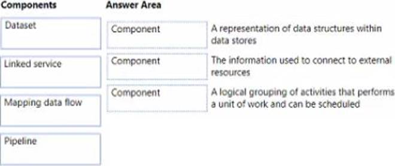

### A representation of data structures within data stores.

- [ ] Pipeline.
- [x] Dataset.
- [ ] Linked service.
- [ ] Mapping data flow

### The information used to connect to external resources:
 
- [ ] Pipeline.
- [ ] Dataset.
- [x] Linked service.
- [ ] Mapping data flow

### A logical grouping of activities that performs a unit of work and can be scheduled.

- [x] Pipeline.
- [ ] Dataset.
- [ ] Linked service.
- [ ] Mapping data flow

### Which Azure Data Factory component provides the compute environment for activities?

- [ ] A linked service.
- [x] An integration runtime.
- [ ] A control flow.
- [ ] A pipeline.

### You have an application that runs on Windows and requires access to a mapped drive. Which Azure service should you use?

- [x] Azure Files.
- [ ] Azure Blob storage.
- [ ] Azure Cosmos DB.
- [ ] Azure Table storage.

### Match the types of analytics that can be used to answer the business questions.

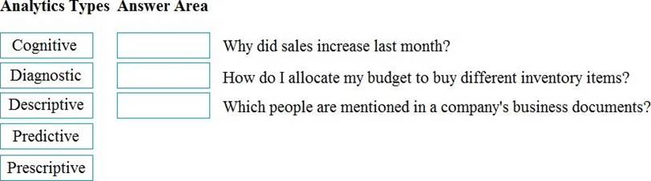

- [ ] Why did sales increase last month?: Cognitive. How do I allocate my budget to buy different inventory items?: Predictive. Which people are mentioned in a company's business documents?: Prescriptive.
- [x] Why did sales increase last month?: Diagnostic. How do I allocate my budget to buy different inventory items?: Predictive. Which people are mentioned in a company's business documents?: Cognitive.
- [ ] Why did sales increase last month?: Descriptive. How do I allocate my budget to buy different inventory items?: Prescriptive. Which people are mentioned in a company's business documents?: Predictive.
- [ ] Why did sales increase last month?: Predictive. How do I allocate my budget to buy different inventory items?: Prescriptive. Which people are mentioned in a company's business documents?: Diagnostic.

### Match the Azure services to the appropriate locations in the architecture.

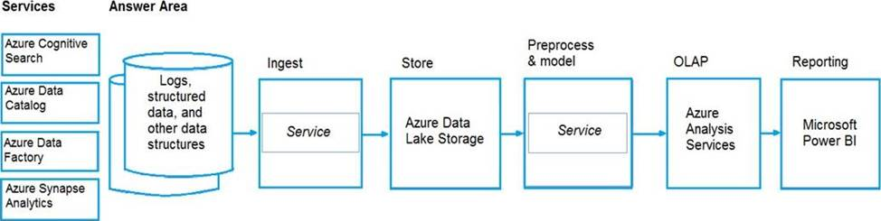

- [x] Ingest: Azure Data Factory. Preprocess & model: Azure Synapse Analytics.
- [ ] Ingest: Azure Data Factory. Preprocess & model: Azure Cognitive Search.
- [ ] Ingest: Azure Synapse Analytics. Preprocess & model: Azure Cognitive Search.
- [ ] Ingest: Azure Cognitive Search. Preprocess & model: Azure Synapse Analytics.

### You must apply patches to Azure SQL databases regularly,

- [ ] Yes.
- [x] No.

### You need a Microsoft 365 subscription to create an Azure SQL database.

- [ ] Yes.
- [x] No.

### You can use existing Microsoft SQL Server licenses to reduce the cost of Azure SQL databases.

- [x] Yes.
- [ ] No.

### If you have a platform as a service (PaaS) database in Azure, you are responsible for applying operating system updates.

- [ ] Yes.
- [x] No.

### If you have a platform as a service (PaaS) database in Azure, backups are performed automatically.

- [x] Yes.
- [ ] No.

### If you have a platform as a service (PaaS) database in Azure, you are responsible for upgrading the database engine.

- [ ] Yes.
- [x] No.

### A visualization that shows a university's current student enrollment versus the maximum capacity is an example of [...] analytics.

- [ ] cognitive.
- [x] descriptive.
- [ ] predictive.
- [ ] prescriptive.

### Match the Azure Data Lake Storage terms to the appropriate levels in the hierarchy.

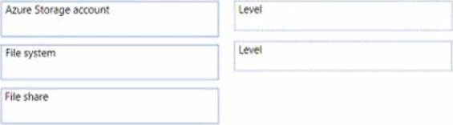

- [ ] Box 1: File system. Box 2: File share.
- [ ] Box 1: Azure Storage account. Box 2: File system.
- [ ] Box 1: File share. Box 2: File system.
- [x] Box 1: Azure Storage account. Box 2: File share.

### You can copy a dashboard between Microsoft Power BI workspaces.

- [ ] Yes.
- [x] No.

### A Microsoft Power BI dashboard can only display visualizations from a single dataset.

- [ ] Yes.
- [x] No.

### A Microsoft Power BY dashboard can display visualizations from a Microsoft Excel workbook.

- [x] Yes.
- [ ] No.

### You can query a graph database in Azure Cosmos DB [...].

- [x] as a JSON document by using a SQL-like language.
- [ ] as a partitioned row store by using Cassandra Query Language (CQL).
- [ ] as a partitioned row store by using Language-Integrated Query (LINQ).
- [ ] as nodes and edges by using the Gremlin language.

### At which level in Azure Cosmos DB can you configure multiple write regions and read regions?

- [ ] database.
- [ ] partition.
- [x] collection.
- [ ] account.

### Extract Trandform Load (ETL).

- [ ] Azure Analysis Services.
- [x] Azure Data Factory.
- [ ] Azure Table storage.
- [ ] Azure Cosmos DB.
- [ ] Azure Synapse Analytics.

### Data warehouse.

- [ ] Azure Analysis Services.
- [ ] Azure Data Factory.
- [ ] Azure Table storage.
- [ ] Azure Cosmos DB.
- [x] Azure Synapse Analytics.

### Which storage solution supports role-based access control (RBAC) at the file and folder level?

- [ ] Azure Disk Storage.
- [x] Azure Data Lake Storage.
- [ ] Azure Blob storage.
- [ ] Azure Queue storage.

### What should you use in Microsoft Power BI?

- [ ] A dashboard.
- [ ] Microsoft Power Apps.
- [ ] A dataflow.
- [x] A report.

### The massively parallel processing (MPP) engine of Azure Synapse Analytics [...].

- [x] distributes processing across compute nodes.
- [ ] distributes processing across control nodes.
- [ ] redirects client connections across compute nodes.
- [ ] redirects client connections across control nodes.

### An extract, transform, and load (ETL) process requires [...].

- [ ] a matching schema in the data source and the data target.
- [x] a target data store powerful enough to transform data.
- [ ] data that is fully processed before being loaded to the target data store.
- [ ] that the data target be a relational database.

### Which two Azure services can be used to provision Apache Spark clusters?

- [ ] Azure Time Series Insights.
- [x] Azure HDInsight.
- [x] Azure Databricks.
- [ ] Azure Log Analytics.

### You manage an application that stores data in a shared folder on a Windows server. You need to move the shared folder to Azure Storage. Which type of Azure Storage should you use?

- [ ] Queue.
- [ ] Blob.
- [x] File.
- [ ] Table.

### When provisioning an Azure Cosmos DB account, which feature provides redundancy within an Azure region?

- [ ] Multi-master replication.
- [x] Availability Zones.
- [ ] Automatic failover.
- [ ] The strong consistency level.

### Which clause should you use in a select statement to combine rows in one table with rows in another table?

- [x] JOIN.
- [ ] VALUES.
- [ ] Set.
- [ ] KEY.

### What should you use to build a Microsoft Power BI paginated report?

- [x] Power BI report Builder.
- [ ] Power BI Desktop.
- [ ] Charticulator.
- [ ] The Power BI service.

### You need to modify a view in a relational database by adding a new column. Which statement should you use?

- [ ] MERGE.
- [x] ALTER.
- [ ] INSERT.
- [ ] UPDATE.

### Transparent Data Encryption (TDE) encrypts [...].

- [ ] a column to protect data at rest and in transit.
- [ ] queries and their results in order to protect data in transit.
- [x] the database to protect data at rest.
- [ ] the server to protect data at rest.

### Transcribing audio files is an example of [...] analytics.

- [x] Cognitive.
- [ ] Descriptive.
- [ ] Predictive.
- [ ] Prescriptive.

### Your company is designing a database that will contain session data for a website. The data will include notifications, personalization attributes, and products that are added to a shopping cart. Which type of data store will provide the lowest latency to retrieve the data?

- [x] key/value.
- [ ] graph.
- [ ] columnar.
- [ ] document.

### Which two Azure services can be used to provision Spark clusters?

- [x] Azure Databricks.
- [ ] Azure Log Analytics.
- [ ] Azure Time Series Insights.
- [ ] Azure HDinsight.

### You need to recommend a non-relational data store that is optimized for storing and retrieving files, videos, audio stream, and virtual disk images. The data store must store data, some metadata, and a unique ID for each file. What should the developers use?

- [x] Azure Data Studio.
- [ ] sq1cmd.
- [ ] Microsoft SQL Server Management Studio (SSMS).
- [ ] Azure Data Explorer.

### You need to recommend a non-relational data store that is optimized for storing and retrieving files, videos, audio stream, and virtual disk images. The data store must store data, some metadata, and a unique ID for each file. Which type of data store should you recommend?

- [ ] document.
- [ ] key/value.
- [x] object.
- [ ] columnar.

### Match the Azure Cosmos DB APIs to the appropriate data structures.

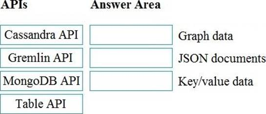

- [ ] Graph data: Cassandra API. JSON documents: Table API. Key/value data: MongoDB API.
- [ ] Graph data: Gremlin API. JSON documents: MongoDB API. Key/value data: Table API.
- [ ] Graph data: Table API. JSON documents: Gremlin API. Key/value data: Cassandra API.
- [x] Graph data: Gremlin API. JSON documents: MongoDB API. Key/value data: Table API.

### Your company needs to design a database that illustrates the relationships between utilization levels of individual network devices across a local area network. Which type of data store should you use?

- [ ] graph.
- [x] key/value.
- [ ] document.
- [ ] columnar.

### Which type of data store should you recommend?

- [ ] Document.
- [ ] Key/value.
- [x] Object.
- [ ] Columnar.

### When ingesting data from Azure Data Lake Storage across Azure regions, you will incur costs for bandwidth.

- [x] Yes.
- [ ] No.

### You can use blob, table, and file storage in the same Azure Storage account.

- [x] Yes.
- [ ] No.

### You implement Azure Data Lake Storage by creating an Azure Storage account.

- [x] Yes.
- [ ] No.

### You have an Azure SQL database that you access directly from the internet. You recently changed your external IP address. After changing the IP address, you can no longer access the database. You can connect to other resources in Azure. What is a possible cause of the issue?

- [x] A database-level firewall.
- [ ] Role-based access control (RSAC).
- [ ] Dynamic Host Configuration Protocol (DHCP).
- [ ] Domain Name Service (DNS).

### A pipeline is a representation of a data structure within Azure Data Factory.

- [ ] Yes.
- [x] No.

### Azure data Factory pipelines can execute other pipelines.

- [x] Yes.
- [ ] No.

### A processing step within an Azure Data Factory pipeline is an activity.

- [ ] Yes.
- [x] No.

### A bar chart showing year-to date sales by regionis an example of which type of analytics?

- [ ] Descriptive.
- [x] Diagnostic.
- [ ] Predictive.
- [ ] Prescriptiv.

### Azure Databricks can consume data from Azure SQL Databate.

- [ ] Yes.
- [x] No.

### Azure Databricks can consume data from Azure Event Hubs.

- [ ] Yes.
- [x] No.

### Azure Databricks can consume data from Azure Cosmos DB.

- [x] Yes.
- [ ] No.

### Which Azure Data Factory component initiates the execution of a pipeline?

- [ ] A control flow.
- [x] A trigger.
- [ ] A parameter.
- [ ] An activity.

### Relational database tables contain columns and rows.

- [x] Yes.
- [ ] No.

### Indexes in a relational database describe the data types in a table.

- [ ] Yes.
- [x] No.

### A database view is a virtual table whose content is defined by a query.

- [x] Yes.
- [ ] No.

### Which three requirements must be met to query the table from the internet?

- [ ] You must be assigned the Reader role for the resource group that contains the database.
- [x] You must have SELECT access to the Products table.
- [x] You must have a user in the database.
- [ ] You must be assigned the Contributor role for the resource group that contains the database.
- [x] Your IP address must be allowed to connect to the database.

### When can you use an Azure Resource Manager template?

- [x] To automate the creation of an interdependent group of Azure resources in a repeatable way.
- [ ] To automate the creation of an interdependent and develop can deploy from the Azure portal.
- [ ] To provision Azure subscriptions and apply policies for multi-tenant deployments.
- [ ] To set complex permissions automatically on existing objects in an Azure subscription.

### Which three objects can be added to a Microsoft Power BI dashboard?

- [x] A report page.
- [ ] A Microsoft PowerPoint slide.
- [x] A visualization from a report.
- [ ] A dataflow.
- [x] A text box.

### Which two activities can be performed entirely by using the Microsoft Power BI service?

- [x] Report and dashboard creation.
- [ ] Report sharing and distribution.
- [ ] Data modeling.
- [x] Data acquisition and preparation.

### When using the Azure Cosmos DB Gremlin API, the container resource type is projected as a [...].

- [x] graph.
- [ ] table.
- [ ] partition key.
- [ ] document.

### You are reviewing the data model shown in the following exhibit. Use the drop-down menus to select the answer choice that completes each statement based on the information presented in the graphic. The data model is a [...].

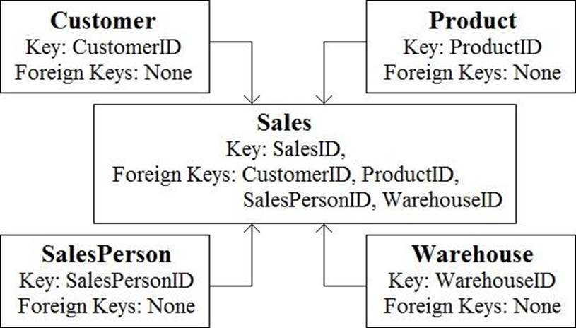
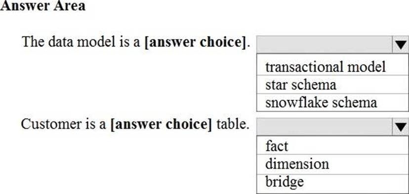

- [ ] transactional model.
- [ ] star schema.
- [x] snowflake schema.

### You are reviewing the data model shown in the following exhibit. Use the drop-down menus to select the answer choice that completes each statement based on the information presented in the graphic. Customer is a [...] table.

- [ ] fact.
- [x] dimension.
- [ ] bridge.

### A bar chart showing year-to date sales by region is an example of which type of analytics?

- [ ] descriptive.
- [x] diagnostic.
- [ ] predictive.
- [ ] prescriptive.

### Match the types of workloads the appropriate scenario.

- [x] Data for a product catalog will be loaded every 12 hours to a data warehouse: Batch. Data for online purchases will be loaded to a Gata warehouse as the purchases occur: Streaming. Updates to inventory data will be loaded to a data warehouse every 1,000 transactions: Micro-batch.
- [ ] Data for a product catalog will be loaded every 12 hours to a data warehouse: Micro-batch. Data for online purchases will be loaded to a Gata warehouse as the purchases occur: Streaming. Updates to inventory data will be loaded to a data warehouse every 1,000 transactions: Batch.
- [ ] Data for a product catalog will be loaded every 12 hours to a data warehouse: Micro-batch. Data for online purchases will be loaded to a Gata warehouse as the purchases occur: Streaming. Updates to inventory data will be loaded to a data warehouse every 1,000 transactions: Batch.
- [ ] Data for a product catalog will be loaded every 12 hours to a data warehouse: Batch. Data for online purchases will be loaded to a Gata warehouse as the purchases occur: Micro-batch. Updates to inventory data will be loaded to a data warehouse every 1,000 transactions: Streaming.

### Your company plans to load data from a customer relationship management (CRM) system to a data warehouse by using an extract load, and transform (ELT) process. Where does data processing occur for each stage of the ELT process?

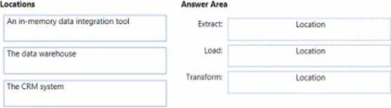

- [ ] Extract: The data warehouse. Load: An in-memory data integration tool. Transform: The CRM system.
- [ ] Extract: The data warehouse. Load: The CRM system. Transform: An in-memory data integration tool.
- [x] Extract: The CRM system. Load: The data warehouse. Transform: An in-memory data integration tool.
- [ ] Extract: The CRM system. Load: An in-memory data integration tool. Transform: The data warehouse.

### You have a SQL query that combines customer data and order data. The query includes calculated columns. You need to persist the SQL query so that other users can use the query. What should you create?

- [ ] a table.
- [x] an index.
- [ ] scalar function.
- [ ] a view.

### Your company is designing a data store tor internet-connected temperature sensors. The collected data will be used to analyze temperature trends.Which type of data store should you use?

- [ ] relational.
- [ ] columnar.
- [ ] graph.
- [x] time series.

### In Azure Data Factory, you can use [...] to orchestrate pipeline ctivities that depend on the output of other pipeline activities.

- [x] a control flow.
- [ ] a dataset.
- [ ] a linked service.
- [ ] an integration runtime.

### Match the Azure services to the appropriate locations in the architecture.

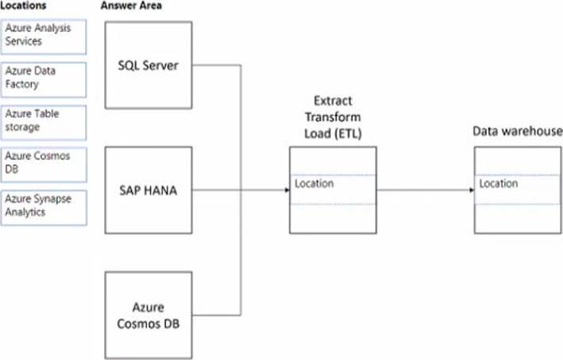

- [ ] Extract Transform Load (ETL): Azure Data Factory. Data warehouse: Azure Cosmos DB.
- [ ] Extract Transform Load (ETL): Azure Table storage. Data warehouse: Azure Cosmos DB.
- [x] Extract Transform Load (ETL): Azure Data Factory. Data warehouse: Azure Synapse Analytics.
- [ ] Extract Transform Load (ETL): Azure Synapse Analytics. Data warehouse: Azure Table storage.

### What is a benefit of the Azure Cosmos DB Table API as compared to Azure Table storage?

- [ ] Supports partitioning.
- [ ] Provides resiliency if art Azure region fads.
- [ ] Provides a higher storage capacity.
- [x] Supports a multi-master model.

### Which statement is an example of Data Manipulation Language (DML)?

- [x] INSERT.
- [ ] DISABLE.
- [ ] ALTER.
- [ ] DROP.

### An extract, transform, and load (ETL) process requires [...].

- [ ] a matching schema in the data source and the data target.
- [ ] a target data store powerful enough to transform data.
- [ ] data that is fully processed before being loaded to the target data store.
- [x] that the data target be a relational database.

### Relational data is stored in [...].

- [ ] A file system as unstructured data.
- [x] A hierarchal folder structure.
- [ ] A tabular form of rows and columns.
- [ ] Comma-separated value (CSV) files.

### When you create an Azure SQL database, which account can always connect to the database?

- [ ] The Azure Active director/ (Azure AO) account that created the database.
- [ ] The Azure Active Directly Azure AD) administrator account.
- [ ] The sa account.
- [x] The server admin login account of the logical server.

### Descriptive analytics tells you [...].

- [ ] What is most likely to occur in the future.
- [x] What occured in the past.
- [ ] Which actions you can perform to affect outcomes.
- [ ] Why something occured in the past.

### You have a transactional application that stem data in an Azure SQL managed instance. When should you implement a read-only database replica?

- [x] You need to generate reports without affecting the transactional workload.
- [ ] You need to audit the transactional application.
- [ ] You need to implement high availability in the event of a regional outage
- [ ] You need to improve the recovery point objective (RPO).

### Relational data uses [...] to enforce relationships between different tables.

- [ ] collections.
- [ ] columns.
- [x] keys.
- [ ] partitions.

### An extract,load, and transform (ELT) process requires [...]

- [ ] a data pipeline that includes a transformation engine.
- [ ] separate transformation engine.
- [ ] a target data store powerful enough to transform data.
- [x] data that is fully processed before being loaded to the target data store.

### Match the Azure services to appropriate requirements. [...] Output data to Parquet format.

- [x] Azure Data Factory.
- [ ] Azure Synapse Analytics.
- [ ] Azure Data Lake Storage.
- [ ] Azure SQL Database.

### Match the Azure services to appropriate requirements. [...] Store data that is in Parquet format.

- [ ] Azure Data Factory.
- [ ] Azure Synapse Analytics.
- [x] Azure Data Lake Storage.
- [ ] Azure SQL Database.

### Match the Azure services to appropriate requirements. [...] Persist a tabular representation of data that is stored in Parquet format.

- [ ] Azure Data Factory.
- [x] Azure Synapse Analytics.
- [ ] Azure Data Lake Storage.
- [ ] Azure SQL Database.

### The massively parallel processing (MPP) engine of Azure Synapse Analytics [...].

- [ ] distributes processing across compute nodes.
- [ ] distributes processing across control nodes.
- [x] redirects client connections across compute nodes.
- [ ] redirects client connections across control nodes.

### Normalization involves eliminating relationships between database tables.

- [ ] Yes.
- [x] No.

### Normalizing a database reduces data redundancy.

- [x] Yes.
- [ ] No.

###  Normalization improves data integrity.

- [x] Yes.
- [ ] No.

### Which two types of replica can you us for the storage account?

- [x] Read-access geo-redundant storage (RA_GRS).
- [ ] Zone-redundant storage (ZRS).
- [x] Geo-redundant storage (GRS).
- [ ] Locally-redundant storage (LRS).

### Your company has a reporting solution that has paginated reports. The reports query a dimensional model in a data warehouse. Which type of processing does the reporting solution use?

- [ ] Stream processing.
- [ ] Online Transaction Processing (OLTP).
- [ ] Batch processing.
- [x] Online Analytical Processing (OLAP).

### Match the types of workloads the appropriate scenario. Updates to inventory data will be loaded to adata warehouse every 1,000 transactions.

- [x] Batch.
- [ ] Streaming.

### What are two characteristics of real-time data processing?

- [x] Data is processed as it is created.
- [x] Low latency is expected.
- [ ] High latency acceptable.
- [ ] Data is processed periodically.

### Platform as a service (PaaS) database offerings in Azure provide administrators with the ability to control adn update the operating system version [...].

- [ ] Yes.
- [x] No.

### All platform as a service (PaaS) database offerings in Azure can be paused to reduce costs.

- [x] Yes.
- [ ] No.

### A graphical tool for managing Azure SQL databases and viewing SQL execution plans.

- [ ] Azure Data Studio.
- [ ] Microsoft SQL Server Data Tools (SSDT).
- [x] Microsoft SQL Server Management Studio (SSMS).
- [ ] Microsoft Visual Studio Code.

### A Microsoft SQL Server extension that supports connections to SQL Server and provides a rich editing experience for T-SQL.

- [ ] Azure Data Studio.
- [ ] Microsoft SQL Server Data Tools (SSDT).
- [ ] Microsoft SQL Server Management Studio (SSMS).
- [x] Microsoft Visual Studio Code.

### A lightweight editor that can run on-demand SQL queries and view and save results as text. JSON, or Microsoft Excel files.

- [x] Azure Data Studio.
- [ ] Microsoft SQL Server Data Tools (SSDT).
- [ ] Microsoft SQL Server Management Studio (SSMS).
- [ ] Microsoft Visual Studio Code.

### A development tool for building Azure SQL databases, Microsoft SQL Server relational databases, SQL Server Analysis Services (SSAS) data models. SQL Server Integration Services (SSIS) packages, and SQL Server Reporting Services (SSRS) reports.

- [ ] Azure Data Studio.
- [x] Microsoft SQL Server Data Tools (SSDT).
- [ ] Microsoft SQL Server Management Studio (SSMS).
- [ ] Microsoft Visual Studio Code.

### Your company if designing an application that will write a high volume of JSON data and will have an application-defined schema. Which type of data store should you use?

- [x] Key/value.
- [ ] Document.
- [ ] Graph.
- [ ] Columnar.

### Your company plans to load data from a customer relationship management (CRM) system to a data warehouse by using an extract load, and transform (ELT) process. Where does data processing occur for each stage of the ELT process?

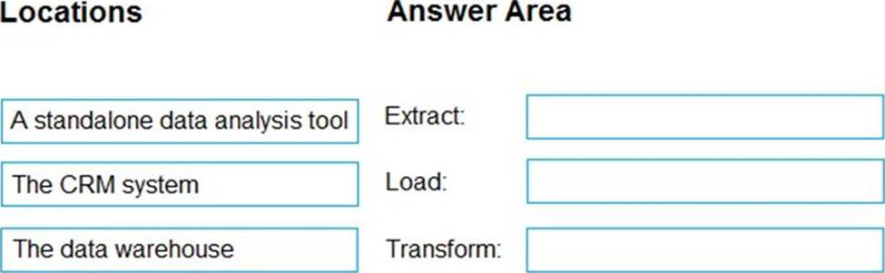

- [ ] Extract: The data warehouse. Load: A standalone data analysis tool. Transform: The CRM system.
- [ ] Extract: The data warehouse. Load: The CRM system. Transform: A standalone data analysis tool.
- [x] Extract: The CRM system. Load: The data warehouse. Transform: A standalone data analysis tool.
- [ ] Extract: The CRM system. Load: A standalone data analysis tool. Transform: The data warehouse.

### You have a table named Sales that contains the following data. You need to query the table to return the average sales amount day. The output must produce the following results. How should you complete the query?

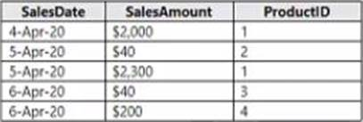
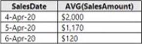
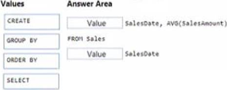

- [ ] CREATE.
- [x] GROUP BY.
- [ ] ORDER BY.
- [x] SELECT.

### What are two uses of data visualization?

- [x] Represent trends and patterns over time.
- [ ] Communicate the significance of data.
- [x] Implement machine learning to predict future values.
- [ ] Consistently implement business logic across reports.

### Which two Azure services can be used to provision Spark clusters?

- [x] Azure Databricks.
- [ ] Azure Log Analytics.
- [ ] Azure Time Series Insights.
- [x] Azure HDinsight.

### To configure an Azure Storage account to support both security at the folder level and atomic directory manipulation [...].

- [ ] Enable the hierarchical namespace.
- [x] Set Account kind to BlobStorage.
- [ ] Set Performance to Premium.
- [ ] Set Replication to Read-access geo-redundant storage (RA-GRS).

### Match the types of data to the appropriate Azure data services. To answer, drag the appropriate data types from the column on the left to its service on the right. Each data type may be used once, more than once, or not at all. NOTE: Each correct match is worth one point.

- [x] Box 1: Image files, Box 2: Azure Cosmos DB Gremlin API, Box 3: Key-value pairs.
- [ ] Box 1: Azure Cosmos DB Gremlin Box 2: Image files, Box 3: Key-value pairs.
- [ ] Box 1: Key-value pairs, Box 2: Image files, Box 3: Azure Cosmos DB Gremlin.

### What are two benefits of platform as a service (PaaS) relational database offerings in Azure, such as Azure SQL Database?

- [ ] Complete control over backup and restore processes.
- [x] Access to the latest features.
- [x] In-database machine learning services.
- [ ] Reduced administrative effort for managing the server infrastructure.

### Azure Synapse Analytics scales storage and compute independently.

- [x] Yes.
- [ ] No.

### Azure Synapse Analytics can be paused to reduce compute costs.

- [x] Yes.
- [ ] No.

### An Azure Synapse Analytics data warehouse has fixed storage capacity.

- [ ] Yes.
- [x] No.

### In batch processing [...].

- [ ] data is always insertes one row at a time.
- [ ] data is processed in real-time.
- [x] latency is expected.
- [ ] processing car only execute serially.

### Your company needs to ensure that in Azure virtual machine can connect to Azure SQL databases without exposing the databases to the internet. What should you use?

- [ ] Azure DNS.
- [ ] Azure Application Gateway.
- [x] Azure Private link.
- [ ] Azure Traffic Manager.

### You have a SQL query that combines customer data and order data. The query includes calculated columns. You need to persist the SQL query so that other users can use the query. What should you create?

- [ ] a table.
- [ ] an index.
- [ ] scalar function.
- [x] a view.

### A relational database must be used when [...].

- [ ] a dynamic schema is required.
- [ ] data will be stored as key/value pairs.
- [ ] storing large images and videos.
- [x] strong consistency guarantees are required.

### You have the following JSON document. Use the drop-down menus to select the answer choice that completes each statement based on the information presented in the JSON document. Customer is [...].

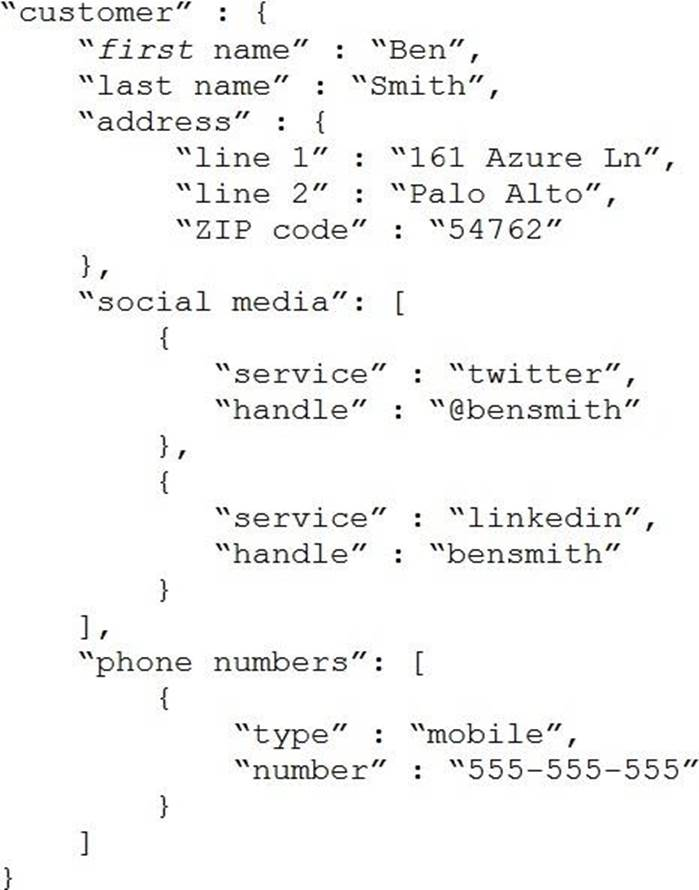
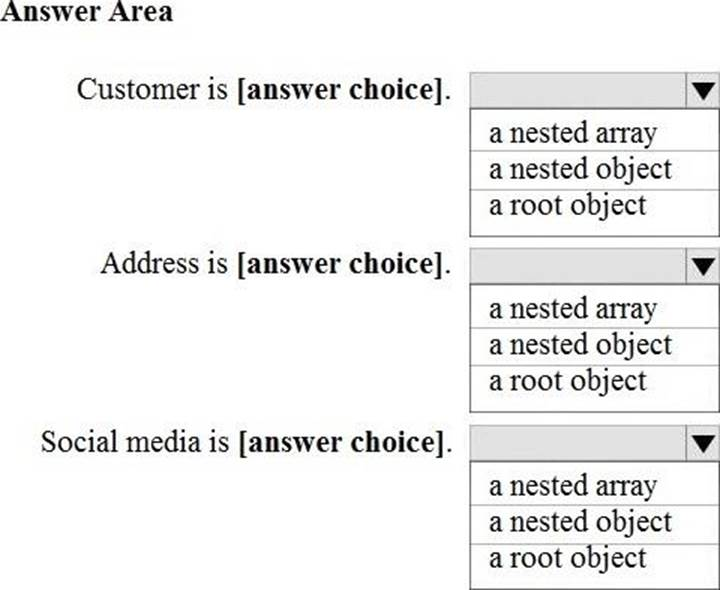

- [ ] a nested array.
- [ ] a nested object.
- [x] a root object.

### You have the following JSON document. Use the drop-down menus to select the answer choice that completes each statement based on the information presented in the JSON document. Address is [...].

- [ ] a nested array.
- [x] a nested object.
- [ ] a root object.

### You have the following JSON document. Use the drop-down menus to select the answer choice that completes each statement based on the information presented in the JSON document. Social media is [...].

- [x] a nested array.
- [ ] a nested object.
- [ ] a root object.

### Platform as a service (PaaS) database offerings in Azure require less seup and configuration effort than infrastructure as a service (IaaS) database offerings.

- [x] Yes.
- [ ] No.

### Platform as a service (PaaS) database offerings in Azure provide administrators with the ability to control and update the operating system version.

- [ ] Yes.
- [x] No.

### All platform as a service (PaaS) database offerings in Azure can be paused to reduce costs.

- [x] Yes.
- [ ] No.

### You have an e-commerce application that reads and writes data to an Azure SQL database. Which type of processing does the application use?

- [ ] stream processing.
- [ ] batch processing.
- [ ] Online Analytical Processing (OLTP).
- [x] Online Transaction Processing (OLTP).

### Which database transaction property ensures that transactional changes to a database are preserved during unexpected operating system restarts?

- [ ] consistency.
- [x] durability.
- [ ] isolation.
- [ ] atomicity.

### A processing step within an Azure Data Factory pipeline is an activity.

- [x] Yes.
- [ ] No.

### [...] is responsible for managing the security of the data in a database.

- [x] A database administrator.

### Which statement is an example of Data Definition Language (DDL)?

- [ ] SELECT.
- [ ] JOIN.
- [ ] MERGE.
- [x] CREATE.

### Azure Databricks can consume data from Azure SQL Databate.

- [x] Yes.
- [ ] No.

### Azure Databricks can consume data from Azure Event Hubs.

- [x] Yes.
- [ ] No.

### A visualization that illustrates a university's current student enrollment per department is an example of [...] analytics.

- [ ] cognitive.
- [x] descriptive.
- [ ] predictive.
- [ ] prescriptive.

### [...] natively support the analysis of relationship between entities.

- [x] Column family databases.
- [ ] Document databases.
- [ ] Graph databases.
- [ ] Key-value stores.

### Azure Data Studio can be used to query an Azure SQL database from a device that runs macOS.

- [x] Yes.
- [ ] No.

### You have data saved in the following format. Which format was used?

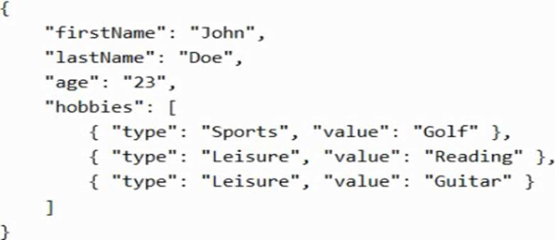

- [ ] XML.
- [ ] yaml.
- [ ] JSON.
- [x] HTML.

### A bank has a system that manages financial transactions. When transferring money between accounts, the system must never retrieve a value for the source account that reflects the balance before the transfer and a value for the destination account that reflects the balance after the transfer. Of which ACID semantic is this an example?

- [ ] atomicity.
- [x] isolation.
- [ ] durability.
- [ ] consistency.

### You have data saved in the following format. Which format was used? 

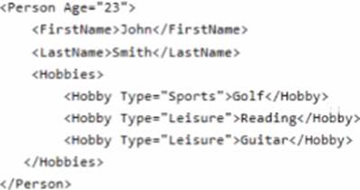

- [ ] YAML.
- [x] HTML.
- [ ] XML.
- [ ] JSON.

### Your company is designing a data store that will contain student data. The data has the following format. Which type of data store should you use?

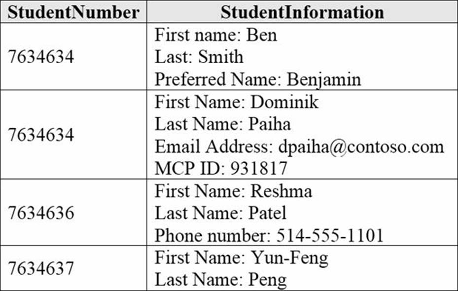

- [ ] graph.
- [ ] key/value.
- [ ] object.
- [x] columnar.

### Match the types of analytics that can be used to answer the business questions.

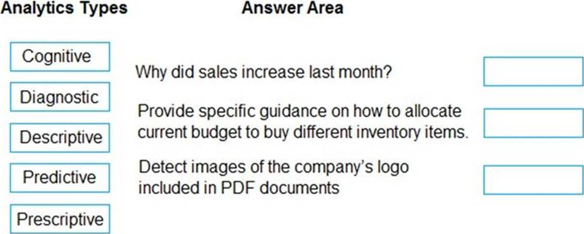

- [ ] Why did sales increase last month?: Cognitive. Provide specific guidance on how to allocate current budget to buy diffetrent inventory items: Predictive. Detect images of the company's logo included in PDF documents: Prescriptive.
- [x] Why did sales increase last month?: Diagnostic. Provide specific guidance on how to allocate current budget to buy diffetrent inventory items: Prescriptive. Detect images of the company's logo included in PDF documents: Cognitive.
- [ ] Why did sales increase last month?: Cognitive. Provide specific guidance on how to allocate current budget to buy diffetrent inventory items: Descriptive. Detect images of the company's logo included in PDF documents: Diagnostic.
- [ ] Why did sales increase last month?: Diagnostic. Provide specific guidance on how to allocate current budget to buy diffetrent inventory items: Predictive. Detect images of the company's logo included in PDF documents: Descriptive.

### A Microsoft Power BI dashboard is associated with a single workspace.

- [ ] Yes.
- [x] No.

### A data engineer is responsible for which task?

- [x] Design and build analytical models.
- [ ] Design and implement data stores for analytical workloads.
- [ ] Explore data to identify trends.
- [ ] Implement policies, tools. and processes for backup and recovery plans.

### In an infrastructure as a service (IaaS) instance of Microsoft SQL Server on Azure, you manage the [...] that hosts SQL Server.

- [x] Answer as below.

### You can query a graph database in Azure Cosmos DB [...].

- [x] Answer as below.

### You need to use Transact-SQL to query files in Azure Data Lake Storage from an Azure Synapse Analytics data warehouse. What should you use to query the files?

- [ ] Azure Functions.
- [ ] Microsoft SQL Server Integration Services (SSIS).
- [x] PolyBase.
- [ ] Azure Data Factory.

### Batch processing can output data to a relational database.

- [ ] Yes.
- [x] No.

### Which command-line tool can you use to query Azure SQL databases?

- [x] sqlcmd.
- [ ] bcp.
- [ ] azdata.
- [ ] Azure CLI.

### What is used to define a query in a stream processing jobs in Azure Stream Analytics?

- [ ] XML.
- [ ] KQL.
- [ ] YAML.
- [x] SQL.

### What is a characteristic of batch processing?

- [ ] The data ingested during batch processing must be processed as soon as the data is received.
- [ ] Large datasets must be split into batches of less than 1 GB before the data can be processed.
- [ ] There is a noticeable time delay between ingesting data and obtaining the data processing results.
- [x] Batch processing can only process data that is structured.

### To configure an Azure Storage account to support access control lists that have object-level permissions [...].

- [x] Enable the hierarchical namespace.
- [ ] Set Account kind to BlobStorage.
- [ ] Set Performance to Premium.
- [ ] Set Replication to Read-access geo-redundant storage (RA-GRS).

### Normalizing a database increases the throughput of writing transactions.

- [x] Yes.
- [ ] No.

### Analytics systems are more normalized than transactional systems.

- [ ] Yes.
- [x] No.

### Normalizing a database results in queries that require more joins.

- [x] Yes.
- [ ] No.

### An Azure Storage account must have [...] enabled to support Azure Data Lake Storage.

- [x] Answer as below.

### Match the types of workloads the appropriate scenario.

- [x] Data for a product catalog will be loaded every 12 hours to a data warehouse: Batch. Data for online purchases will be loaded to a Gata warehouse as the purchases occur: Streaming. Updates to inventory data will be loaded to a data warehouse every 1,000 transactions: Batch.
- [ ] Data for a product catalog will be loaded every 12 hours to a data warehouse: Streaming. Data for online purchases will be loaded to a Gata warehouse as the purchases occur: Streaming. Updates to inventory data will be loaded to a data warehouse every 1,000 transactions: Batch.
- [ ] Data for a product catalog will be loaded every 12 hours to a data warehouse: Batch. Data for online purchases will be loaded to a Gata warehouse as the purchases occur: Streaming. Updates to inventory data will be loaded to a data warehouse every 1,000 transactions: Streaming.
- [ ] Data for a product catalog will be loaded every 12 hours to a data warehouse: Batch. Data for online purchases will be loaded to a Gata warehouse as the purchases occur: Batch. Updates to inventory data will be loaded to a data warehouse every 1,000 transactions: Streaming.

### When provisioning an Azure Cosmos DB [...], you need to specify which type of API you will use.

- [x] account.
- [ ] container.
- [ ] database.
- [ ] item.

### Backing up and restoring data are the responsibilities of a [...].

- [x] Answer as below.

### [...] enables multiple Azure SQL databases to share resources such as memory, data storage space, and processing power.

- [x] Answer as below.

### [...] can be used as part of a lift-and-shift solution for migrating an on-premises application to the cloud with minimal changes.

- [x] Answer as below.

### Creating closed caption text for audio files is an example of [...] analytics.

- [ ] cognitive.
- [x] descriptive.
- [ ] predictive.
- [ ] prescriptive.

### In batch processing, [...].

 [x] Answer as below.

### Match the datastore services to the appropriate descriptions.

- [x] Enables the use of SQL queries against data stored in JSON documents: Azure Cosmos DB. Enables users to access data by using the Server Message Block (SMB) version 3 protocol: Azure Files.
- [ ] Enables the use of SQL queries against data stored in JSON documents: Azure Files. Enables users to access data by using the Server Message Block (SMB) version 3 protocol: Azure Cosmos DB.
- [ ] Enables the use of SQL queries against data stored in JSON documents: Azure Blob storage. Enables users to access data by using the Server Message Block (SMB) version 3 protocol: Azure Table storage.
- [ ] Enables the use of SQL queries against data stored in JSON documents: Azure Cosmos DB. Enables users to access data by using the Server Message Block (SMB) version 3 protocol: Azure Table storage.

### You need to store data by using Azure Table storage. What should you create first?

- [ ] an Azure Cosmos DB instance.
- [x] a storage account.
- [ ] a blob container.
- [ ] a table.

### You have a SQL pool in Azure Synapse Analytics that is only used actively every night for eight hours. You need to minimize the cost of the SQL pool during idle times. The solution must ensure that the data remains intact. What should you do on the SQL pool?

- [ ] Scale down the data warehouse units (DWUs).
- [x] Pause the pool.
- [ ] Create a user-defined restore point.
- [ ] Delete the pool.

### [...] presents content defined by a query.

- [ ] A heap.
- [ ] A stored procedure.
- [x] A view.
- [ ] An index.

### What can be used with native notebook support to query and visualize data by using a web-based interface?

- [x] Azure Databricks.
- [ ] pgAdmin.
- [ ] Microsoft Power Bl.

### [...] is responsible for managing the security of the data in a database.

- [ ] A data analyst.
- [ ] A data engineer.
- [ ] A data scientist.
- [x] A database administrator.

### [...] provides a full range of Power BI data modeling and report editing features.

- [x] Microsoft Power BI Desktop.
- [ ] The Microsoft Power BI service.
- [ ] The Microsoft Power BI phone app.

### Which Azure service provides the highest compatibility for databases migrated from Microsoft SQL Server 2019 Enterprise edition?

- [ ] an Azure SQL Database elastic pool.
- [x] Azure SQL Managed Instance.
- [ ] Azure Database for MySQL.
- [ ] Azure SQL Database.

### [...] is responsible for identifying which business rules must be applied to the data of a company.

- [ ] A data analyst.
- [ ] A data engineer.
- [x] A data scientist.

### Match the tools to the appropriate descriptions.

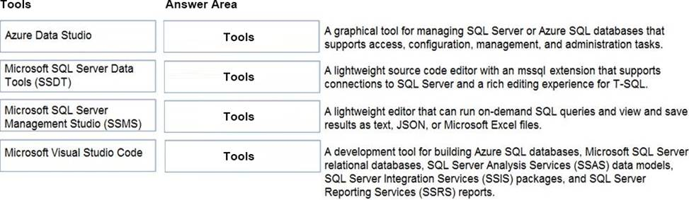

- [x] A graphical tool for managing SQL Server or Azure SQL databases that supports access, configuration, management, and administration tasks: Microsoft SQL Server Data Tools (SSMS). A lightweight source code editor with an mssql extension that supports connections to SQL Server and a rich editing experience for T-SQL: Microsoft Visual Studio Code. A lightweight editor that can run on-demand SQL queries and view and save results as text, JSON, or Microsoft Excel files: Azure Data Studio. A development tool for building Azure SQL databases, Microsoft SQL Server relational databases, SQL Server Analysis Services (SSAS) data models, SQL Server Integration Services (SSIS) packages, and SQL Server Reporting Services (SSRS) reports: Microsoft SQL Server Data Tools (SSDT).
- [ ] A graphical tool for managing SQL Server or Azure SQL databases that supports access, configuration, management, and administration tasks: Azure Data Studio. A lightweight source code editor with an mssql extension that supports connections to SQL Server and a rich editing experience for T-SQL: Microsoft SQL Server Data Tools (SSMS). A lightweight editor that can run on-demand SQL queries and view and save results as text, JSON, or Microsoft Excel files: Azure Data Studio. A development tool for building Azure SQL databases, Microsoft SQL Server relational databases, SQL Server Analysis Services (SSAS) data models, SQL Server Integration Services (SSIS) packages, and SQL Server Reporting Services (SSRS) reports: Microsoft SQL Server Data Tools (SSDT).
- [ ] A graphical tool for managing SQL Server or Azure SQL databases that supports access, configuration, management, and administration tasks: Microsoft SQL Server Data Tools (SSMS). A lightweight source code editor with an mssql extension that supports connections to SQL Server and a rich editing experience for T-SQL: Microsoft Visual Studio Code. A lightweight editor that can run on-demand SQL queries and view and save results as text, JSON, or Microsoft Excel files: Microsoft SQL Server Data Tools (SSDT). A development tool for building Azure SQL databases, Microsoft SQL Server relational databases, SQL Server Analysis Services (SSAS) data models, SQL Server Integration Services (SSIS) packages, and SQL Server Reporting Services (SSRS) reports: Azure Data Studio.
- [ ] A graphical tool for managing SQL Server or Azure SQL databases that supports access, configuration, management, and administration tasks: Microsoft Visual Studio Code. A lightweight source code editor with an mssql extension that supports connections to SQL Server and a rich editing experience for T-SQL: MMicrosoft SQL Server Data Tools (SSMS). A lightweight editor that can run on-demand SQL queries and view and save results as text, JSON, or Microsoft Excel files: Microsoft SQL Server Data Tools (SSDT). A development tool for building Azure SQL databases, Microsoft SQL Server relational databases, SQL Server Analysis Services (SSAS) data models, SQL Server Integration Services (SSIS) packages, and SQL Server Reporting Services (SSRS) reports: Azure Data Studio.

### An extract, transform, and load (ETL) process requires [...].

- [ ] a matching schema in the data source and the data target.
- [ ] a target data store powerful enough to transform data.
- [x] data that is fully processed before being loaded to the target data store.
- [ ] that the data target be a relational database.

### By default, each Azure SQL database is protected by [...].

- [ ] a network security group (NSG).
- [ ] a server-level firewall.
- [x] Azure Firewall.
- [ ] Azure Front Door.

### Your company is designing a database that will contain session data for a website. The data will include notifications, personalization attributes, and products that are added to a shopping cart. Which type of data store will provide the lowest latency to retrieve the data?

- [ ] key/value.
- [ ] graph.
- [x] columnar.
- [ ] document.

### Which two settings can you configure at the container level? Each correct answer presents a complete solution.

- [x] the throughput.
- [ ] the read region.
- [x] the partition key.
- [ ] the API.

### In a graph database, edges specify relationships between [...].

- [x] Answer as below.

### [...] is responsible for creating visuals and charts that help a company make informed decisions.

- [ ] A data analyst.
- [x] A data engineer.
- [ ] A data scientist.
- [ ] A database administrator

### A [...] is a chart of colored rectangles. The size of the rectangles represent the relative value of each item. The chart can be hierarchical,displaying data as a set of rectangles nested within the main rectangle.

- [ ] line chart.
- [ ] matrix.
- [ ] scatter.
- [x] treemap.

### A database object that holds data.

- [ ] Index.
- [ ] View.
- [x] Table.

### A database object whose content is defined by a query.

- [ ] Index.
- [x] View.
- [ ] Table.

### A database object that helps improve the speed of data retrieval.

- [x] Index.
- [ ] View.
- [ ] Table.

### What are two characteristics of real-time data processing? Each correct answer present a complete solution.

- [x] Data is processed as it is created.
- [x] Low latency is expected.
- [ ] High latency acceptable.
- [ ] Data is processed periodically.

### [...] is an object associated with a table that sorts and stores data rows based on their key values.

- [x] Answer as below.

### In Azure Table storage, each row in a table must be uniquely identified by which two components?

- [ ] a timestamp.
- [ ] a range.
- [x] a row key.
- [x] a partition key.

### Match the terms to the appropriate descriptions.

- [x] Azure Data Explorer: KQL. Azure Stream Analytics: SQL. Azure Synapse Analytics: Python.
- [ ] Azure Data Explorer: SQL. Azure Stream Analytics: KQL. Azure Synapse Analytics: Python.
- [ ]Azure Data Explorer: Python. Azure Stream Analytics: SQL. Azure Synapse Analytics: KQL.

### An Azure Storage account must have [...] enabled to support Azure Data Lake Storage.

- [ ] Blob soft delete.
- [x] Hierarchical namespace.
- [ ] Large file shares.
- [ ] Versioning.

### A JSON document is an example of [...].

- [x] Answer as below.

### A relational database is appropriate for scenarios that involve a high volume of [...].

- [x] Answer as below.

### You need to store event log data that is semi-structured and received as the logs occur. What should you use?

- [ ] Azure Table storage.
- [x] Azure Queue storage.
- [ ]  Azure Files.

### Which three objects can be added to a Microsoft Power BI dashboard? Each correct answer presents a complete solution.

- [x] a report page.
- [ ] a Microsoft PowerPoint slide.
- [x] a visualization from a report.
- [ ] a dataflow.
- [x] a text box.

### [...] is a platform as a service (PaaS) relational data service that uses massively parallel processing (MPP).

- [ ] Azure SQL Database.
- [x] Azure Synapse Analytics.
- [ ] Azure Database for MariaDB.
- [ ] SQL Server on Azure on Azure virtual machines.

### You need to ensure that users use multi-factor authentication (MFA) when connecting to an Azure SQL database. Which type of authentication should you use?

- [ ] service principal authentication.
- [x] Azure Active Directory (Azure AD) authentication.
- [ ] SQL authentication.
- [ ] certificate authentication.

### You need to store event log data that is semi-structured and received as the logs occur. What should you use?

- [x] Azure Table storage.
- [ ] Azure Queue storage.
- [ ] Azure Files.

### In a SQL statement, [...] are examples of aggregate functions.

- [ ] FROM and WHERE.
- [ ] GROUP BY and ORDER BY.
- [ ] JOIN and MERGE.
- [x] MAX and MIN.

### You have data saved in the following format. Which format was used? 

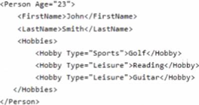
- [ ] YAML.
- [ ] HTML.
- [x] XML.
- [ ] JSON.

### Online analytical processing (OLAP) systems are particurarly suitable for analytical workloads because data is [...].

- [ ] limited in size.
- [x] optimized for transactions.
- [ ] pre-aggregated.
- [ ] read-only.

### Match the types of data to the appropriate Azure data services.

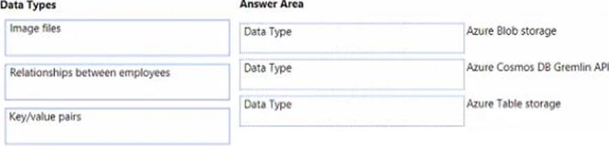

- [x] No answer.

### You need to create an Azure resource to store data in Azure Table storage. Which command should you run?

- [ ] az scorage share create.
- [x] az scorage account creace.
- [ ] az cosmosdb creace.
- [ ] az scorage concainer creace.

### What is the primary purpose of a data warehouse?

- [x] To provide answers to complex queries that rely on data from multiple sources.
- [ ] To provide transformation services between source and target data stores.
- [ ] To provide read-only storage of relational and non-relational historical data.
- [ ] To provide storage for transactional line-of-business (LOB) applications.

### Which T-SQL statement should be used to instruct a database management system to use an index instead of performing a full table scan?

- [ ] WHERE.
- [x] SELECT.
- [ ] JOIN.

### Which component of Azure Data Factory enables you to define a sequence of activities including for each iterators?

- [ ] Control flow.
- [x] Linked services.
- [ ] Datasets.
- [ ] The integration runtime.

### Azure SQL Database includes a fully managed backup service.

- [x] Yes.
- [ ] No.

### Azure SQL Database has built-in high availability.

- [x] Yes.
- [ ] No.

### Azure SQL Database can use Azure Advanced Threat Protection (ATP).

- [x] Yes.
- [ ] No.

### Database administrators apply data cleansing routines and turn data into useful information.

- [ ] Yes.
- [x] No.

### Data engineers manage databases, store backup copies of data, and restore data in the event of failure.

- [ ] Yes.
- [x] No.

### Data analyst create data visuals and enable companies to make data-driven decisions.

- [x] Yes.
- [ ] No.
